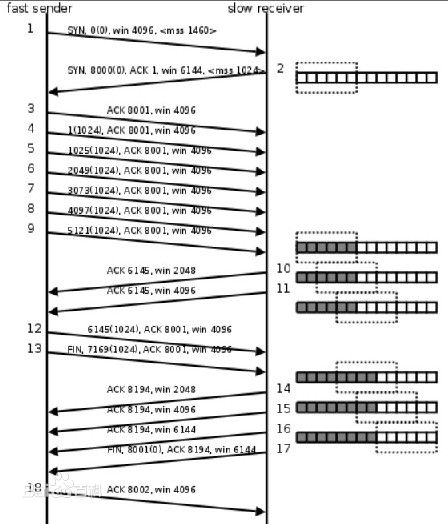

# `网络结构`
## `OSI模型`
  

### 1、物理层
    利用传输介质为数据链路层提供物理连接，实现比特流的透明传输。
* #### RJ232，RJ45
|脚位 |	简写 |	意义 |	说明 |
|----|-----|----|-----|
|Pin1 |	DCD |	Data Carrier Detect |	调制解调器通知计算机有载波被侦测到。|
|Pin2 |	RXD |	Receiver |	接收数据。|
|Pin3 |	TXD |	Transmit |	发送数据。|
|Pin4 |	DTR |	Data Terminal Ready |	计算机告诉调制解调器可以进行传输。|
|Pin5 	|GND |	Ground |	地线。|
|Pin6 |	DSR |	Data Set Ready |	调制解调器告诉计算机一切准备就绪。|
|Pin7 |	RTS |	Request To Send |	计算机要求调制解调器将数据提交。|
|Pin8 |	CTS |	Clear To Send |	调制解调器通知计算机可以传数据过来。|
|Pin9 |	RI |	Ring Indicator |	调制解调器通知计算机有电话进来。|
* #### 集线器 Hub
    碰撞网域

* #### 编码格式

* #### 信道复用
    时分复用，频分复用，码分复用

### 2、数据链路层
    通过各种控制协议，将有差错的物理信道变为无差错的、能可靠传输数据帧的数据链路。
分为MAC和LLC层 
`MAC子层`的主要任务是解决共享型网络中多用户对信道竞争的问题，完成网络介质的访问控制；
`LLC子层`的主要任务是建立和维护网络连接，执行差错校验、流量控制和链路控制。

* #### MAC地址：地址
MAC地址共48位（6个字节），以十六进制表示。前24位由IEEE决定如何分配，后24位由实际生产该网络设备的厂商自行指定。

ff:ff:ff:ff:ff:ff则作为广播地址。 
* #### CRC
简单
* #### 滑动窗口

* #### Ethernet

    * 拓扑结构

    * CSMA/CD

      * 1、发送特殊阻塞信息并立即停止发送数据：特殊阻塞信息是连续几个字节的全1信号，此举意在强化碰撞，以使得其它设备能尽快检测到碰撞发生。
      * 2、在固定时间（一开始是1 contention period times）内等待随机的时间，再次发送。
      * 3、若依旧碰撞，则采用截断二进制指数避退算法进行发送。即十次之内停止前一次“固定时间”的两倍时间内随机再发送，十次后则停止前一次“固定时间”内随机再发送。尝试16次之后仍然失败则放弃发送。

    * 传输帧结构

        * 802.3 以太网帧结构 :类型，数据46-1500octet
        * 以太网帧结构 ：数据大于1500octet

* #### 交换机
`第一层交换机`：端口交换

交换机可用于划分数据链路层广播，即`冲突域`；但它不能划分网络层广播，即`广播域`。 
交换机内部的CPU会在每个端口成功连接时，通过将MAC地址和端口对应，形成一张`MAC表`。 
万一交换机收到一个不认识的数据包，就是说如果目的地MAC 地址不能在地址表中找到时，交换机会把IP 数据包`"扩散"`出去，即把它从每一个端口中提交去

  * 工作流程
      * 收到某网段（设为A）MAC地址为X的计算机发给MAC地址为Y的计算机的数据包。交换机从而记下了MAC地址X在网段A。这称为`学习（learning）`。
      * 交换机还不知道MAC地址Y在哪个网段上，于是向除了A以外的所有网段转发该数据包。这称为`泛洪（flooding）`。
      * MAC地址Y的计算机收到该数据包，向MAC地址X发出确认包。交换机收到该包后，从而记录下MAC地址Y所在的网段。
      * 交换机向MAC地址X转发确认包。这称为`转发（forwarding`）。
      * 交换机收到一个数据包，查表后发现该数据包的来源地址与目的地址属于同一网段。交换机将不处理该数据包。这称为`过滤（filtering）`。
      * 交换机内部的MAC地址-网段查询表的每条记录采用时间戳记录最后一次访问的时间。早于某个阈值（用户可配置）的记录被清除。这称为`老化（aging）`。

`第二层交换机`：MAC交换,创建MAC地址与端口的映射表。 
第二层交换机通常提供很高的吞吐量（线速）、低延时（10 微秒左右），每端口的价格比较经济。 
第二层缺点：对广播风暴、异种网络互连、安全性控制等不能有效地解决。

`第三层交换机`：IP交换,第二层交换技术＋第三层转发技术。 

* #### Vlan
    一个VLAN相当于OSI模型第2层的广播域 
    VLAN可以为网络提供以下作用：

      广播控制,带宽利用,降低延迟,安全性（非设计作用，本身功能所附加出的）
  * 三种vlan

      * `端口`

          直接以交换机上的端口做为划分VLAN的基础。 

      * `MAC`

          以每台主机的MAC地址做为划分VLAN的基础。 
          创建某网络设备的MAC地址与VLAN的映射关系数据库 
          `缺点`是网管人员必须在交换机中设置组织内每一台设备MAC地址与VLAN间的映射关系数据库。 

      * `IP`

          以每台设备的IP地址做为划分VLAN的基础 
          `缺点`: 解析IP，效率低

      
* #### Spanning tree（SPR）

    防止交换机冗余链路产生的环路.用于确保以太网中无环路的逻辑拓扑结构.从而避免了广播风暴,大量占用交换机的资源.  
    `工作原理:`任意一交换机中如果到达根网桥有两条或者两条以上的链路.生成树协议都根据算法把其中一条切断,仅保留一条.从而保证任意两个交换机之间只有一条单一的活动链路.
* #### 网桥

### 3、网络层 Internet
    adressage，routage
    通过路由选择算法，为报文或分组通过通信子网选择最适当的路径。
* #### ARP/RARP
    根据目的主机的IP地址，获得其MAC地址。
    ARP缓存表 (windows arp -a, linux arp -nv)

    * 1.当发送数据时，主机A会在自己的ARP缓存表中寻找是否有目标IP地址。

    * 2.如果在ARP缓存表中没有找到相对应的IP地址，主机A就会在网络上发送一个广播（ARP request）

    * 3.网络上其他主机并不响应ARP询问，只有主机B接收到这个帧时，才向主机A做出这样的回应（ARP response
* #### ICMP
* #### MTU
* #### MPLS
* #### IPv6 包结构
* #### CSMA/CD
* #### 无线路由
  * CSMA/CA
  * AP
  * 站点暴露，站点隐藏问题
* #### IPv4 包结构
* #### 路由协议
  * 静态：
  * 动态：
    * RIPv1，RIPv2
    * OSPF
    * BGP
* #### NAT，PAT
* #### DNS
* #### DHCP
  * 申请过程

### 4、传输层 Transport
    该层是通信子网和资源子网的接口和桥梁，起到承上启下的作用。
    提供端到端的差错和流量控制，保证报文的正确传输。传输层的作用是向高层屏蔽下层数据通信的细节，即向用户透明地传送报文。
* #### TCP
  * 包结构
  * 三次握手，四次结束，传输的包
* #### UDP
  * 包结构
* #### 端口

### 5、会话层 Session
    建立会话，管理会话
    用户应用程序和网络之间的接口，组织和协调两个会话进程之间的通信，并对数据交换进行管理。
* #### Session
* #### Cookie

### 6、表达层
    处理用户信息的表示问题，如编码、数据格式转换和加密解密

### 7、应用层
    直接向用户提供服务，完成用户希望在网络上完成的各种工作。
* #### PPP

## `TCP/IP模型`
    实质内容放在上文OSI模型中，在此只介绍结构以及没有提到的地方

## `其他协议及内容`
* #### Tunnel
* #### Socket

## `网络安全`
* #### SSL
* #### VPN
	* 三种vpn
* #### X501
	* #### 证书
		* 信任链
		* 根证书，中间，末端证书
		* 过期

* #### 3DS，AES
* #### MD5
* #### RSA
* #### Delfi-heiman

##  `应用`
* #### Wireshark
* #### 路由交换机
	* ACL访问控制
* #### SAN

* #### NAS

* #### 存储阵列
	* RAID0，1，5

* #### MARIADB集群

* #### 日志管理
	* Firebeat
	* Elasticresearch
	* Logstash
	* Kibana
* #### nmap

# `操作系统`

## `原理`

## `LINUX`
* #### 网络管理：
  * Interface
	* Netplan
	* Ifconfig
	* arp
* #### 挂载
	* Mount
	* lsblk
* #### 进程
	* Ps
* #### 基本指令
  *
* 查询
* vim

## `Windows`
* #### 权限管理
* #### 网络管理：
	* Ipconfig
  * arp
